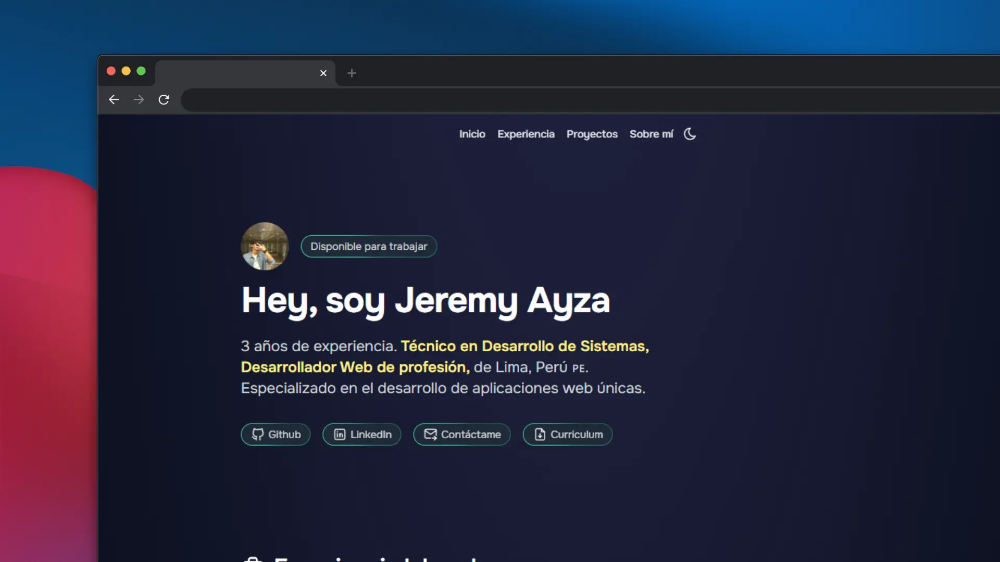

# 👨🏻‍💻 Porfolio para programadores y desarrolladores

## 🫂 Contribuidores

Aquí tienes una versión **clara, organizada y pensada para alguien que recién empieza en frontend**, que quiere ayudarte como asistente para mantener tu portafolio actualizado.
También agrego **una lista adicional de cosas importantes** que muchas veces se olvidan.

---

## ✅ **Tareas explicadas para alguien que recién empieza **

### **1) Verificar que los proyectos estén desplegados**

Muchos proyectos necesitan estar disponibles en internet para que un reclutador los pueda ver rápidamente.
Tu tarea es revisar si cada proyecto ya está desplegado. Si no lo está, súbelo según su tipo:

* **Frontend con frameworks (React, Next, Vue, etc.)**
  → Puedes usar **Render** o **Netlify**

* **Frontend básico (HTML, CSS, JS sin framework)**
  → Puedes usar **GitHub Pages**

Asegúrate de que el enlace funcione correctamente.

---

### **2) Tomar capturas de pantalla de cada proyecto**

Una buena imagen hace que el proyecto se vea más profesional dentro del portafolio.

Pasos:

1. Entra al proyecto en el navegador
2. Toma una captura visible de la web
3. Edita la imagen para ponerle un fondo o marco bonito (algo limpio)
4. Guarda la imagen en **formato .webp** (muy importante porque pesa menos)
5. Añádela dentro de la constante `projects.ts` de este repositorio

Esto sirve para mostrar visualmente los proyectos en la web del portafolio.

---

### **3) Verificar que los enlaces a los repositorios sean correctos**

Cada proyecto debe tener:

* Enlace obligatorio a **GitHub**
* Enlace a la **demo** (si es un proyecto frontend)
* Si es backend:

  * verificar si funciona solo o necesita conectarse con un frontend

Corrige cualquier link roto o incompleto.

---

### **4) Completar información faltante en la lista de proyectos**

En cada proyecto de `projects.ts`, revisa que no falten estos datos:

* **Nombre de usuario**: `@JeremyAyza`
* **Imagen demo** (si es frontend)
* **Link del demo** (si está desplegado en Render, Netlify, etc.)
* Para backend:

  * indicar si el demo requiere frontend para mostrarse

Agrega esta información cuando falte.

---

